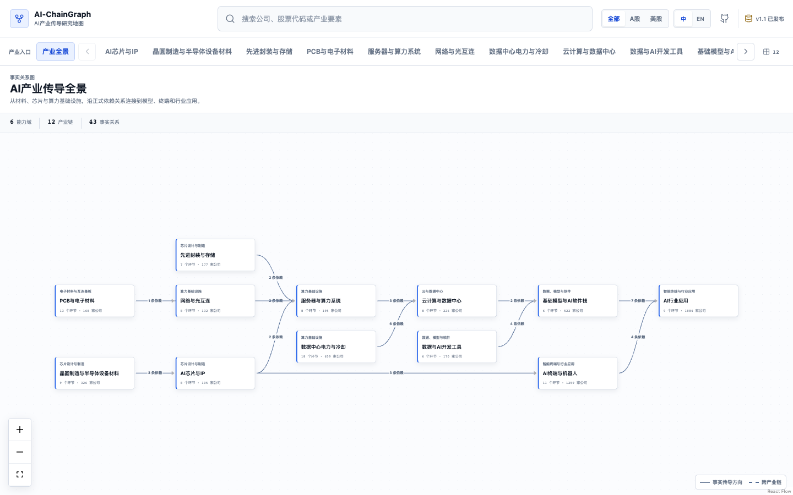
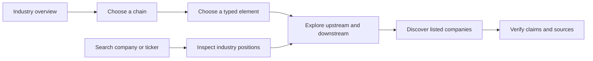
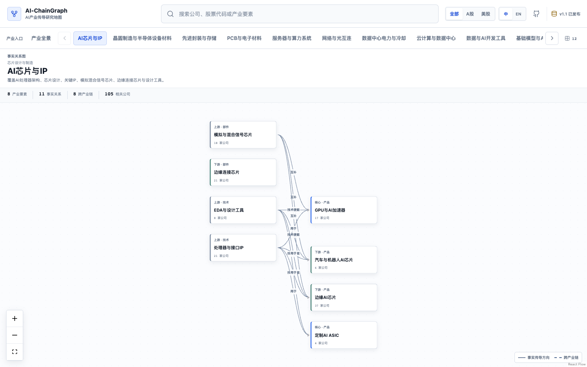
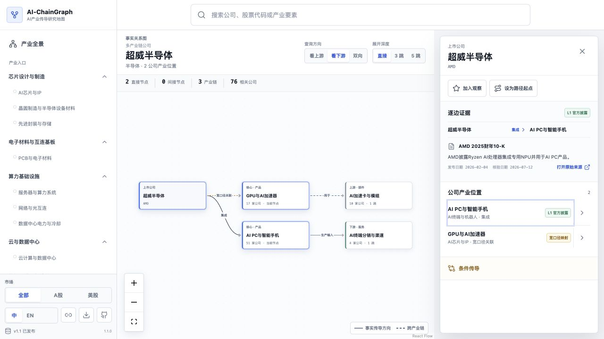
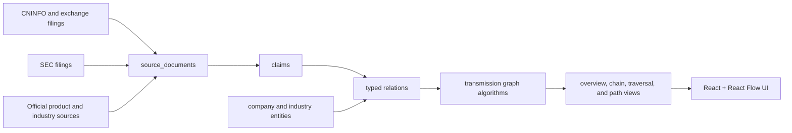

# AI-ChainGraph

> An evidence-traceable AI industry transmission graph connecting industry chains, typed elements, listed companies, and original public sources.

[](https://ai-chaingraph.judefluen.chatgpt.site/)
[](https://github.com/judefluen-coder/ai-chaingraph)
[](https://github.com/judefluen-coder/ai-chaingraph/actions/workflows/ci.yml)
[](https://github.com/judefluen-coder/ai-chaingraph/actions/workflows/weekly-data-quality.yml)
[](LICENSE)
[](DATA_LICENSE.md)

[Live app](https://ai-chaingraph.judefluen.chatgpt.site/) · [GitHub Pages](https://judefluen-coder.github.io/ai-chaingraph/) · English · [简体中文](README.md)

AI-ChainGraph is not another list of "AI concept stocks." It models directed dependencies from materials and semiconductors through compute infrastructure, models, software, devices, and applications. It then places A-share and US-listed companies back into the industry elements they participate in, with public evidence attached to company mappings.

> This project organizes public information for industry research. It does not provide investment advice, buy/sell signals, price targets, return forecasts, or trading strategies.



## What It Helps You Answer

- Where does a company actually sit in the AI value chain?
- What are the upstream inputs, downstream uses, and cross-chain dependencies of an industry element?
- How can an effect travel from chips and servers to data centers, models, devices, and applications?
- Is a company mapping backed by direct disclosure, industry evidence, or only a broad association?
- Which filing or public document supports the relationship?

## Core Workflows

| Research task | Capability |
| --- | --- |
| Discover companies from an industry | Navigate 6 capability domains, 12 chains, and 111 industry segments |
| Reverse-map a company | Search by company or ticker and inspect all mapped products, components, services, and applications |
| Explore transmission | Traverse upstream, downstream, or both directions at 1, 3, or 5 hops |
| Compare paths | Set any entity as a path origin and find the shortest path to another entity |
| Verify relationships | Distinguish L1 official disclosure, L2 industry evidence, and broad mappings; then open the original source |
| Explore scenarios | Overlay demand, supply, price, capacity, policy, or technology changes without mixing them with fact edges |
| Build a research watchlist | Save companies locally with priority, tags, review dates, and research notes, then export them as CSV |
| Share research context | Encode the company, relationship, chain, direction, and depth in the URL so the same view can be restored |
| Work across markets | Filter A-shares and US-listed securities and switch between Chinese and English |



## Product Screens

### Chain-level transmission

The AI Chips & IP view connects EDA, processor IP, analog chips, GPUs, ASICs, edge chips, and their listed-company coverage in one directed graph.



### Company position and edge-level evidence

Open a company to see its industry positions. Select a mapping to inspect its evidence level, factual excerpt, publication date, and original document.



## v1.2 Public Snapshot

The relationship layer was refreshed on **2026-09-08**. Underlying public sources currently run through **2026-09-04**, and every new A-share listing has been reconciled through **2026-09-08**. Check time, data-change time, and listing-reconciliation coverage are tracked separately.

| Object | Count |
| --- | ---: |
| Capability domains | 6 |
| Industry chains | 12 |
| Industry segments | 111 |
| Issuers / securities | 4,548 |
| Company-to-element mappings | 6,621 (5,996 specific; 625 broad) |
| Issuers with specific relations | 4,244 (93.3%) |
| Directed industry dependencies | 173 |
| Evidence claims | 6,643 |
| Public source documents | 4,636 |

Companies may appear in multiple chains and elements, so chain-level company counts are not unique-company totals.

## Weekly Update Mechanism

The project uses a reviewed weekly cycle instead of writing crawler output directly into the public graph:

1. Every Monday, compare official SSE, SZSE, and BSE listing notices with the latest [`listing reconciliation manifest`](data/listing-reconciliations/README.md). Every new listing receives an explicit `included` or `excluded` decision and reason.
2. An included listing must add an issuer, security, L1 issuance relationship, and at least one evidence-backed specific industry relationship.
3. Approved relationships enter through [`data/weekly-candidates/`](data/weekly-candidates/README.md) with a public HTTPS source, reviewable claim, explicit action, and L1/L2 evidence level.
4. `npm run update:weekly` validates the complete listing manifest, imports approved batches, and promotes broad mappings only when linked evidence contains an explicit issuer action.
5. Snapshot validation, relationship-depth auditing, and the production build must pass before GitHub and the existing OpenAI Sites project are updated.
6. GitHub Actions rejects a check or A-share listing reconciliation older than eight days and requires at least 90% of issuers to retain a specific relationship.

The current manifest reviews all 30 A-share listings from July 13 through September 8, 2026: 11 are included and 19 are explicitly excluded. US-listed issuer reconciliation remains a separate SEC and exchange-source review.

Each run writes [`public/snapshots/update-status.json`](public/snapshots/update-status.json). See [`docs/WEEKLY_UPDATES.md`](docs/WEEKLY_UPDATES.md) for the complete process and evidence policy.

## Architecture



The public contract has four core collections:

- `entities`: domains, chains, segments, products, components, materials, equipment, services, issuers, and securities.
- `relations`: directed dependencies, company positions, security issuance, and their `claim_ids`.
- `claims`: reviewable factual excerpts linked to source documents.
- `source_documents`: source metadata, dates, public URLs, language, and issuer references.

The static app reads [`public/snapshots/transmission-v1.1.json`](public/snapshots/transmission-v1.1.json) directly and requires no paid API or user account.

## Technology

- React 18 and Vite
- React Flow for interactive graph exploration
- Dagre for automatic directed layouts
- Graph traversal, shortest-path, and conditional transmission utilities
- A bilingual view model over one canonical snapshot
- A left-side research workspace, persistent scope inspector, local watchlist, and research notes
- Restorable URL state for entities, relationships, chains, traversal, paths, and scenarios
- A reviewed weekly snapshot shared by GitHub Pages and OpenAI Sites

## Run Locally

Node.js `22.13+` is required.

```bash
git clone https://github.com/judefluen-coder/ai-chaingraph.git
cd ai-chaingraph
npm ci
npm run validate:snapshot
npm run dev
```

Create a production build with:

```bash
npm run build
```

## Evidence Semantics

- **L1 official disclosure:** a regulatory filing, exchange announcement, or official company material directly supports the mapping.
- **L2 industry evidence:** public industry material supports a structural dependency between industry elements.
- **Specific element:** evidence supports a product, component, material, equipment, or service-level position.
- **Broad mapping:** evidence supports a wider industry association but not a more specific product claim.
- **Conditional transmission:** a research hypothesis layered over, and visually separated from, verified fact relations.

Coverage is not conviction. Always inspect the evidence level, excerpt, and original source before using a company mapping.

## Contributing

Contributions are welcome for ontology quality, entity normalization, evidence links, bilingual UX, graph layout, and snapshot validation. Before opening a pull request, run:

```bash
npm run validate:snapshot
npm run audit:relationships
npm run build
```

Do not contribute paid-database exports, restricted full text, personal account data, credentials, or unlicensed long-form content. See [CONTRIBUTING.md](CONTRIBUTING.md).

## License

- Software: MIT, see [LICENSE](LICENSE).
- Original graph structure and public project data: CC BY 4.0, see [DATA_LICENSE.md](DATA_LICENSE.md).
- Linked third-party source material remains subject to its owners' terms.

## Disclaimer

AI-ChainGraph is an information organization and industry research aid, not an investment decision tool. A displayed company relationship only means that the current public graph connects the company to an industry element. It does not express a view on company value, business quality, share-price direction, or future returns. Always verify the original source independently.
