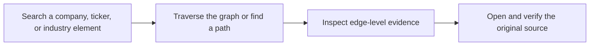
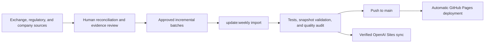
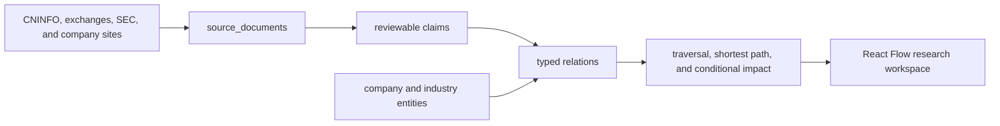

<div align="center">

# AI-ChainGraph

**An evidence-traceable graph of AI value chains, listed companies, and original public sources**

Trace directed industry relationships from materials, chips, and compute infrastructure to models, devices, and applications. Discover companies from an industry element, reverse-map a company to its value-chain positions, and inspect the public evidence behind every mapping.

[GitHub Pages](https://judefluen-coder.github.io/ai-chaingraph/) · [OpenAI Sites mirror](https://ai-chaingraph.judefluen.chatgpt.site/) · [简体中文](README.md)

[](public/snapshots/update-status.json)
[](https://github.com/judefluen-coder/ai-chaingraph/actions/workflows/ci.yml)
[](https://github.com/judefluen-coder/ai-chaingraph/actions/workflows/weekly-data-quality.yml)
[](LICENSE)
[](DATA_LICENSE.md)

</div>

[](https://judefluen-coder.github.io/ai-chaingraph/)

> AI-ChainGraph is not another list of "AI concept stocks." It answers: **What does a company actually do in the AI value chain, where does it sit, how is it connected upstream and downstream, and which public source supports that conclusion?**

## Current Snapshot

| Listed issuers | Chains / segments | Company mappings | Specific mappings | Public sources |
| ---: | ---: | ---: | ---: | ---: |
| **4,548** | **12 / 111** | **6,621** | **5,996 (93.3% of issuers)** | **4,636** |

- Data version: **v1.2.0**
- Relationship layer last changed: **2026-09-08**
- Included sources run through: **2026-09-04**
- New A-share listings reconciled through: **2026-09-08**
- Markets: A-shares and US-listed securities

Companies may appear in multiple segments, so chain-level company counts are not unique-company totals. Check time, actual data-change time, and listing-reconciliation coverage are tracked separately in [`update-status.json`](public/snapshots/update-status.json).

## What You Can Do

| Research task | Capability |
| --- | --- |
| Discover companies from an industry | Navigate 12 chains and 111 typed segments across A-shares and US listings |
| Reverse-map a company | Search by name or ticker and inspect its products, components, materials, equipment, services, and applications |
| Trace transmission | Traverse upstream, downstream, or both directions at 1, 3, or 5 hops |
| Compare connections | Set any entity as a path origin and find the shortest path to another entity |
| Verify a relationship | Inspect the action, evidence level, factual excerpt, publication date, and original document |
| Preserve research context | Store filters, nodes, paths, and scenarios in the URL; keep watchlists and notes in the browser |



## Explore Real Data

GitHub Pages is the default public entry point. The OpenAI Sites deployment is a mirror for networks that can access it.

| Example | GitHub Pages | OpenAI Sites |
| --- | --- | --- |
| AI transmission overview | [Open](https://judefluen-coder.github.io/ai-chaingraph/) | [Mirror](https://ai-chaingraph.judefluen.chatgpt.site/) |
| AI Chips and IP | [Open](https://judefluen-coder.github.io/ai-chaingraph/?chain=chain%3Aai_chips_ip) | [Mirror](https://ai-chaingraph.judefluen.chatgpt.site/?chain=chain%3Aai_chips_ip) |
| Unitree Robotics (688836) | [Open](https://judefluen-coder.github.io/ai-chaingraph/?entity=issuer%3Acn-sh-688836) | [Mirror](https://ai-chaingraph.judefluen.chatgpt.site/?entity=issuer%3Acn-sh-688836) |
| ChangXin Technology / CXMT (688825) | [Open](https://judefluen-coder.github.io/ai-chaingraph/?entity=issuer%3Acn-sh-688825) | [Mirror](https://ai-chaingraph.judefluen.chatgpt.site/?entity=issuer%3Acn-sh-688825) |

## Core Experience

### Discover companies from a value chain

The graph places EDA, processor IP, analog chips, GPUs, ASICs, and edge-connectivity chips in one directed view. Every node can be expanded upstream or downstream and inspected for listed-company coverage.


### Return from a company to its position and evidence

Search by company or ticker to inspect its positions across chains, products, and applications. Select a relationship to review its evidence level, factual excerpt, publication date, and original source.


## Evidence and Data Boundaries

Coverage only matters when relationships are specific and reviewable. v1.2 increased issuers with specific action relationships from **1,149 (25.3%)** to **4,244 (93.3%)**. The remaining 304 issuers stay broad where the available evidence does not support a narrower claim.

| Semantic | Meaning |
| --- | --- |
| **L1 official disclosure** | A filing, exchange notice, or official company source directly supports the relationship |
| **L2 industry evidence** | Attributable public industry material supports a structural dependency between industry elements |
| **Specific mapping** | Evidence identifies what the company produces, develops, operates, integrates, provides, or distributes |
| **Broad mapping** | Evidence supports participation in a wider area but not a more specific product claim |
| **Conditional transmission** | A research hypothesis layered over, and visually separated from, verified fact relationships |

Known boundaries:

- 304 issuers still have broad mappings only and require more specific, verifiable disclosure.
- The median segment has 22 company mappings; seven segments, including HBM and PCB base laminates, have fewer than five.
- New A-share listings have an explicit reconciliation manifest; US listing coverage still requires a separate SEC and exchange-source reconciliation.
- The product reads a versioned static snapshot. It is not a real-time filing, market-data, or trading system.

Coverage is not conviction, and a mapping is not a recommendation. Always inspect the evidence level, factual excerpt, and original source.

## Use the Graph Data

The public app reads [`public/snapshots/transmission-v1.1.json`](public/snapshots/transmission-v1.1.json). `v1.1` in the filename is the stable contract version; the snapshot content evolves independently through `meta.data_version`, currently `v1.2.0`.

```bash
# Inspect versions, timestamps, and core counts
jq '.meta | {contract_version, data_version, updated_at, counts}' \
  public/snapshots/transmission-v1.1.json

# Inspect relationship quality and sparse segments
jq '.meta.quality | {specific_issuer_rate, sparse_segments}' \
  public/snapshots/transmission-v1.1.json
```

The public contract has four core collections:

```text
entities          issuers, securities, chains, products, components, materials, equipment, services, and applications
relations         industry dependencies, company positions, security issuance, and linked claim_ids
claims            reviewable factual excerpts linked to source-document IDs
source_documents  source titles, dates, public URLs, languages, and issuer references
```

## Update Mechanism

The current process combines **human-reviewed evidence, scripted snapshot imports, and automated GitHub quality gates**. Search or crawler output is never written directly into the public graph.



- [`data/listing-reconciliations/`](data/listing-reconciliations/README.md) records `included` and `excluded` decisions for new A-share listings.
- [`data/weekly-candidates/`](data/weekly-candidates/README.md) contains approved incremental evidence batches.
- `npm run update:weekly` imports approved batches and generates update-status and quality metrics.
- The Monday GitHub Action checks freshness, listing reconciliation, specific-relationship coverage, tests, and the production build. It does not currently collect or commit new evidence.
- A push to `main` deploys GitHub Pages automatically. OpenAI Sites is synchronized separately after the same snapshot passes validation.
- A run with no new evidence may update the check time, but never fabricates a source-cutoff or data-change date.

See [`docs/WEEKLY_UPDATES.md`](docs/WEEKLY_UPDATES.md) for the full evidence policy and release process.

## Architecture



- React 18, Vite, React Flow, and Dagre
- Multi-hop upstream/downstream traversal, shortest paths, and conditional impact utilities
- Chinese and English views generated from one canonical snapshot
- Static deployment with no account, backend service, or paid API required
- Restorable URL state, local watchlists, and local research notes

## Run Locally

Node.js `22.13+` is required.

```bash
git clone https://github.com/judefluen-coder/ai-chaingraph.git
cd ai-chaingraph
npm ci
npm run validate:snapshot
npm run dev
```

Run the complete verification suite with:

```bash
npm test
npm run validate:snapshot
npm run audit:relationships
npm run build
```

## Contributing

Contributions are welcome for ontology quality, entity normalization, evidence links, bilingual UX, graph layout, and validation rules. Run the complete verification suite before opening a pull request.

Do not contribute paid-database exports, restricted full text, personal account data, credentials, or unlicensed long-form content. See [CONTRIBUTING.md](CONTRIBUTING.md).

## License

- Software: MIT, see [LICENSE](LICENSE).
- Original graph structure and public project data: CC BY 4.0, see [DATA_LICENSE.md](DATA_LICENSE.md).
- Linked third-party source material remains subject to its owners' terms.

## Disclaimer

AI-ChainGraph is an information-organization and industry-research aid, not an investment-decision tool. A displayed company relationship only means that the current public graph connects the company to an industry element. It does not express a view on company value, business quality, share-price direction, or future returns. Always verify the original source independently.
