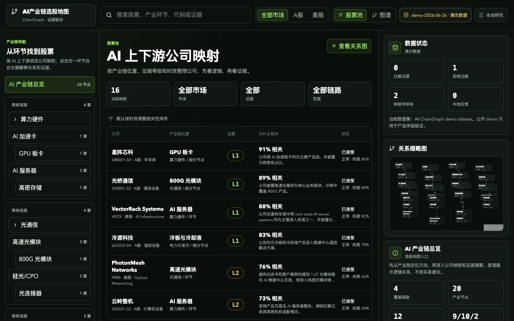

# AI产业链选股地图 / AI-ChainGraph

[](https://github.com/judefluen-coder/ai-chaingraph/actions/workflows/ci.yml)

面向普通投资者和产业研究者的本地优先 AI 产业链知识图谱。它把 A股和美股公司的 AI 上下游位置、关联逻辑、证据等级和审核状态放在同一个清爽工作台里，帮助你先看产业链关系，再看公司和证据。

> AI-ChainGraph 是信息组织与产业研究辅助工具，不提供、不构成、不暗示任何投资建议、买卖建议或交易策略。



## 为什么做

AI 产业链很容易被概念标签淹没：算力、光模块、PCB、液冷、服务器、CPO、封装材料、数据中心电力，每个方向下面又有 A股和美股公司、强弱不一的证据、不同的时效和待审核线索。

这个项目的目标是把这些信息整理成一个可浏览、可筛选、可复核的选股地图：

- 看清公司处在 AI 产业链哪个环节。
- 看清“为什么相关”，而不是只看到概念标签。
- 区分强确证、合理推断和公开线索。
- 保留人工校正和本地审核队列。
- 公开仓库只放代码、schema 和虚构 demo，真实研究数据留在本地或私有仓库。

## 当前能力

- 顶部工作台：品牌、搜索、A股/美股市场筛选、列表/图谱视图切换和数据状态。
- 产业链导航：按算力硬件、光通信、PCB/材料、电力与液冷浏览上中下游节点。
- 公司映射列表：默认首屏展示公司、产业链位置、证据等级、相关理由、状态和纯度。
- 关系图谱：React Flow 展示产业节点和公司映射，点击节点联动详情。
- 详情解释：公司详情、行情快照占位、为什么相关、证据摘要、风险声明。
- 搜索定位：支持股票、代码、产业环节、别名和证据文本，保留右侧搜索上下文。
- 证据筛选：支持全部、L1、L2、L3。
- 人工校正：反馈写入浏览器 localStorage，可导出 JSON/CSV。
- 响应式：桌面三栏，平板列表优先，手机底部 tabs 切换“产业链 / 股票池 / 图谱 / 详情”。

## 本地运行

```bash
npm install
npm run dev
```

Vite 会输出本地地址，通常是 `http://127.0.0.1:5173/`。如果只做检查：

```bash
npm run smoke
npm run validate:example
npm run build
```

欢迎参与改进，贡献前请先阅读 [CONTRIBUTING.md](CONTRIBUTING.md)，尤其是公开仓库与私有研究数据的边界。

## 数据读取顺序

前端仍保持本地优先，不依赖外部服务：

```text
VITE_CHAINGRAPH_API_BASE /api/graph
  -> /snapshots/current.json
  -> src/data/demoGraph.json
```

公开仓库内置的 `src/data/demoGraph.json` 是虚构示例数据，包含 A股和美股两个市场的演示公司，只用于验证 UI 和数据模型。真实或半真实数据应放入被忽略的本地路径，例如 `data/`、`feedbacks/`、`logs/`、`secrets/` 或私有仓库。

## 证据等级

- `L1`：强确证。来自更直接、更可复核的公开来源或用户授权材料。
- `L2`：合理推断。来自多源交叉验证或产业逻辑推断，仍需保留来源。
- `L3`：公开线索。只能作为待审核研究线索，不应直接进入结论。

时效调整相关性会结合证据发布时间、`stale_threshold_days`、关系相关性和纯度字段重新展示。它只用于排序和审核提示，不代表投资评级。

## 本地导入

校验仓库内置的虚构 canonical snapshot 示例：

```bash
npm run import:snapshot -- examples/fictional-ai-chain.snapshot.json
```

校验自己的本地 snapshot：

```bash
npm run import:snapshot -- data/local-only/ai-chain.snapshot.json
```

校验并写入本地 current snapshot 与导入报告：

```bash
npm run import:snapshot -- data/local-only/ai-chain.snapshot.json --write
```

写入产物位于：

- `data/snapshots/current.json`
- `data/import-reports/*.json`

这些文件不会进入 Git 跟踪。若要让前端直接读取本地 current snapshot，可在本地开发时自行把已脱敏 snapshot 复制到被忽略的 `public/snapshots/current.json`，或启动本地 API 并设置 `VITE_CHAINGRAPH_API_BASE`。

## GitHub Pages 预览

仓库包含 `.github/workflows/pages.yml`，合并到 `main` 后可用 GitHub Pages 部署静态预览。启用步骤：

1. 在 GitHub 仓库 Settings -> Pages 中，将 Source 设为 GitHub Actions。
2. 当前 workflow 仅在仓库为 public 时部署；准备公开发布时，将仓库改为 public 后再启用 Pages。
3. 推送到 `main` 后，workflow 会用 `VITE_BASE_PATH=/ai-chaingraph/` 构建并部署 `dist/`。

本地构建仍使用默认根路径：

```bash
npm run build
```

## 技术栈

- React + Vite
- React Flow
- lucide-react
- JSON canonical snapshot
- JSON Schema + SQLite schema 预留

## 项目结构

```text
ai-chaingraph/
├── src/
│   ├── components/
│   │   ├── ChainSidebar.jsx
│   │   ├── CompanyMapList.jsx
│   │   ├── DetailDrawer.jsx
│   │   ├── GraphViewport.jsx
│   │   └── TopBar.jsx
│   ├── data/
│   │   ├── demoGraph.json
│   │   └── loadGraphData.js
│   ├── lib/
│   │   └── graphViewModel.js
│   ├── main.jsx
│   └── styles.css
├── schemas/
│   ├── chaingraph.schema.json
│   └── sqlite-schema.sql
├── scripts/
│   ├── import-snapshot.mjs
│   └── smoke-test.mjs
├── examples/
│   └── fictional-ai-chain.snapshot.json
├── docs/assets/
├── .github/
│   ├── ISSUE_TEMPLATE/
│   └── workflows/
├── public/
├── CONTRIBUTING.md
├── index.html
└── README.md
```

## 开源与私有数据边界

可公开：

- 应用代码、schema、评分算法、ETL 框架、虚构示例数据、文档和免责声明。

应私有：

- 完整 A股/美股映射库、真实证据摘录、抓取缓存、商业数据源结果、个人研究批注和未确认人工校正。

### 仓库边界与提交安全

项目的安全 Git root 应是 `ai-chaingraph/` 项目目录本身，而不是用户主目录或其他上层目录。提交或发布前请先确认：

```bash
pwd
git rev-parse --show-toplevel
git remote -v
git status --short --branch -- .
git ls-files --cached -- data feedbacks logs secrets public/snapshots '*.sqlite' '*.db'
```

期望结果：

- `git rev-parse --show-toplevel` 指向项目根，remote 指向正确 GitHub 仓库。
- `git status --short --branch -- .` 只显示项目内代码、schema、脚本、文档和公开 demo 变更。
- `git ls-files --cached -- data feedbacks logs secrets public/snapshots '*.sqlite' '*.db'` 输出为空。
- 不要把用户目录、`data/local-only/`、`secrets/`、`logs/`、SQLite/DB 文件或商业数据源结果纳入 Git 跟踪。

## 路线图

- 数据层：补齐 CSV/JSONL adapter、真实数据去重、证据冲突检测和 L3 审核工作流。
- API 层：提供 `/api/graph`、`/api/search`、`/api/node/:id`、`/api/review`。
- 研究体验：增加产业链路径对比、公司覆盖矩阵、证据时间线和 watchlist。
- 开源体验：补齐贡献指南、示例 snapshot、README 截图和 GitHub release 说明。

## 免责声明

AI-ChainGraph 是信息组织与产业研究辅助工具，不是投资决策工具。

- 项目中展示的上市公司、产业环节、关联关系、证据等级、示例数据和截图，仅为信息整理与知识呈现。
- 展示某家公司与某个 AI 产业环节相关，不代表对其投资价值、股价走势或经营状况的判断。
- 证据等级只描述信息来源可靠性，不代表未来表现。
- 当前仓库内置公司名、行情和证据均为虚构示例，只用于本地原型验证。
- 使用真实数据前，请自行查证原始来源、授权边界和数据时效。

## License

MIT License. 详见 `LICENSE`。
