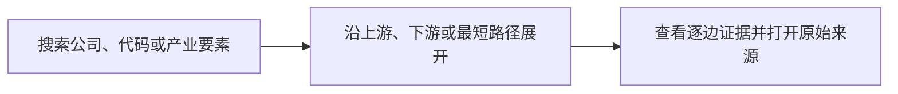
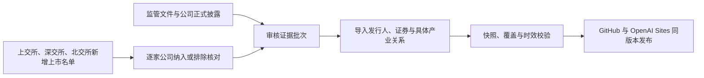
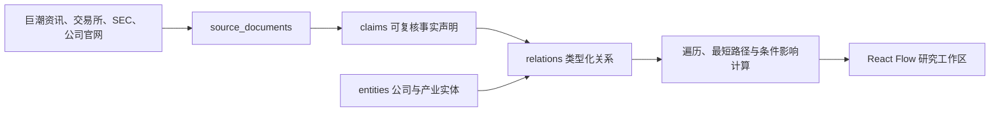

<div align="center">

# AI-ChainGraph

**把 AI 产业链、上市公司和原始证据放进同一张可交互关系图**

从材料、芯片和算力基础设施出发，沿着有方向的产业关系追踪到模型、终端与行业应用。<br>
既能从产业寻找公司，也能从公司反查产业位置，并回到每条关系背后的公开来源。

[在线体验](https://ai-chaingraph.judefluen.chatgpt.site/) · [GitHub Pages](https://judefluen-coder.github.io/ai-chaingraph/) · [English](README.en.md)

[](https://github.com/judefluen-coder/ai-chaingraph/releases)
[](https://github.com/judefluen-coder/ai-chaingraph/actions/workflows/ci.yml)
[](https://github.com/judefluen-coder/ai-chaingraph/actions/workflows/weekly-data-quality.yml)
[](LICENSE)
[](DATA_LICENSE.md)

</div>

[](https://ai-chaingraph.judefluen.chatgpt.site/)

> AI-ChainGraph 不是“AI 概念股名单”，也不回答“应该买什么”。它试图回答的是：**一家公司在 AI 产业链中具体做什么、处在哪一环、与谁构成上下游，以及这个判断来自哪里。**

## 当前覆盖

| **4,548** 家公司 / 证券 | **111** 个产业环节 | **6,621** 条公司产业映射 | **93.3%** 公司具备具体动作关系 |
| ---: | ---: | ---: | ---: |
| A 股与美股 | 分布于 12 条产业链 | 5,996 条为具体关系 | 4,244 家可定位到生产、开发、运营、集成、提供等动作 |

公开快照版本为 **v1.2.0**。关系层最近深化于 **2026-09-08**，已收录来源截止 **2026-09-04**；A 股新增上市名单已逐项核对至 **2026-09-08**。项目把“检查时间”“数据实际变化时间”和“上市核对截止日”分开记录。

## 它能帮你回答什么

传统主题标签只会告诉你“一家公司和 AI 有关”，AI-ChainGraph 继续向下追问：

| 研究问题 | 图谱中的答案 |
| --- | --- |
| 一家公司具体做什么？ | 将公司映射到产品、部件、材料、设备、服务或应用，并标注 `生产 / 开发 / 运营 / 集成 / 提供 / 分销` 等动作 |
| 它位于产业链哪里？ | 同时展示上游输入、核心环节、下游用途和跨链依赖，而不是一组扁平标签 |
| 关系是否可信？ | 每条公司关系保留证据等级、事实摘录、发布日期和原始公开链接 |
| 某个变化会传到哪里？ | 对任意节点进行上游、下游或双向 1 / 3 / 5 跳展开，并支持条件传导推演 |
| 两个对象如何连接？ | 以任意实体为起点，查找与另一产业要素或公司之间的最短路径 |
| 怎样持续跟踪？ | 把公司加入本地观察列表，记录优先级、标签、复核日期与研究假设，并导出 CSV |

## 直接开始探索

无需注册，也不依赖付费 API。可以从下面三个入口直接进入真实数据：

- [浏览 AI 产业传导全景](https://ai-chaingraph.judefluen.chatgpt.site/)
- [打开“AI 芯片与 IP”产业链](https://ai-chaingraph.judefluen.chatgpt.site/?chain=chain%3Aai_chips_ip)
- [查看 AMD 在产业链中的位置](https://ai-chaingraph.judefluen.chatgpt.site/?entity=issuer%3Asec-cik-0000002488)

典型研究路径只有三步：



你也可以反过来从产业进入：选择一条产业链，定位到具体产品或部件，再查看哪些 A 股与美股公司参与其中。

## 核心体验

### 1. 从产业链看公司，而不是从标签猜产业

图谱把 EDA、处理器 IP、模拟芯片、GPU、ASIC、边缘芯片等要素放进同一张有方向的关系图。每个节点都能继续展开上下游，并查看对应公司覆盖。


### 2. 从公司回到产业位置和证据

搜索公司名称或股票代码，即可查看它跨越的产业链、产品和应用位置。选择任意一条关系，可检查关系类型、证据等级、事实摘要、发布日期和原始文件。


### 3. 把研究现场保存下来

当前公司、关系、产业链、市场、方向、展开深度、路径和条件推演都会写入 URL。复制链接即可恢复同一视图；观察列表和研究备注保存在浏览器本地，不会上传个人研究内容。

## 为什么它不只是“公司更多”

覆盖广度只有在关系足够具体、来源可以复核时才有意义。v1.2 将具备具体动作关系的公司从 **1,149 家（25.3%）**提升到 **4,244 家（93.3%）**，同时保留 304 家证据不足的公司为宽口径映射，而不是用推断补齐。

| 数据语义 | 含义 |
| --- | --- |
| **L1 官方披露** | 公司公告、监管文件或公司正式资料直接支持这条关系 |
| **L2 行业资料** | 可归因的公开行业资料支持产业要素之间的结构性关系 |
| **具体关系** | 证据可以说明公司在生产、开发、运营、集成、提供或分销什么 |
| **宽口径映射** | 来源只足以支持公司参与某个较宽范围，不强行推断到具体产品 |
| **条件传导** | 研究假设叠加层，与已经核验的事实关系分开展示 |

> 覆盖不等于判断，映射不等于推荐。使用任何公司关系前，请查看证据等级、事实摘要和原始来源。

## v1.2 数据快照

| 数据对象 | 数量 | 说明 |
| --- | ---: | --- |
| 能力域 | 6 | 芯片、材料、算力、云、软件、终端与应用等上层分组 |
| 产业链 | 12 | 从半导体制造延伸到 AI 行业应用 |
| 产业环节 | 111 | 每条产业链中的细分 segment，当前全部具备公司覆盖 |
| 上市公司 / 证券 | 4,548 | 已标准化的发行人与证券实体 |
| 公司产业映射 | 6,621 | 5,996 条具体动作关系，625 条宽口径映射 |
| 具备具体关系的公司 | 4,244 | 占全部公司的 93.3%，其余 304 家等待更多可验证证据 |
| 产业依赖关系 | 173 | `input_to`、`component_of`、`enables`、`used_in` 等有方向关系 |
| 证据声明 | 6,643 | 从公开文件中提取并关联到图谱关系的事实声明 |
| 公开来源 | 4,636 | 巨潮资讯、SEC、交易所、公司官网及公开产品资料 |

公司可能同时位于多个产业环节，因此各产业链显示的公司数不能直接相加为唯一公司数。当前每个环节的公司映射中位数为 22；HBM、先进制程晶圆代工等低覆盖环节仍是后续周更的优先方向。

## 每周更新，不让快照悄悄过期

项目采用“自动检查、证据准入、验证后发布”的周更流程，不会把搜索结果或爬虫输出直接写进正式图谱。



- **A 股完整核对**：每周对比上交所、深交所和北交所官方新增上市名单；每家公司都记录 `included` 或 `excluded` 及理由。
- **纳入要求**：进入图谱的新上市公司必须同时新增发行人、证券、L1 发行关系和至少一条有证据的具体产业关系。
- **当前核对结果**：2026-07-13 至 2026-09-08 共核对 30 家，纳入 11 家、排除 19 家；核对清单可在 [`data/listing-reconciliations/`](data/listing-reconciliations/README.md) 审阅。
- **每周一 09:00（Asia/Shanghai）**：除上市核对外，继续检查新增官方披露，优先处理宽口径公司和低覆盖产业环节。
- **证据准入**：新增关系必须有公开 HTTPS 来源、可复核事实声明、明确动作和 L1 / L2 等级。
- **发布门槛**：测试、快照校验、关系深度审计和生产构建必须全部通过。
- **质量守门**：GitHub Actions 要求最近检查时间和 A 股上市核对日期均不超过 8 天，具备具体关系的公司比例不低于 90%。
- **诚实时间戳**：没有新证据时只更新 `checked_at`，不会伪造 `source_cutoff_date` 或数据变化日期。

每次运行结果公开写入 [`public/snapshots/update-status.json`](public/snapshots/update-status.json)。完整证据政策和发布流程见 [`docs/WEEKLY_UPDATES.md`](docs/WEEKLY_UPDATES.md)。

## 技术架构



- **React 18 + Vite**：单页应用与静态部署。
- **React Flow + Dagre**：关系图交互、缩放和自动布局。
- **图算法**：上游 / 下游多跳遍历、最短路径和条件影响计算。
- **双语视图模型**：一份规范化快照生成中英文界面与搜索索引。
- **静态优先**：公开站点直接读取版本化 JSON，无需登录或后端服务。
- **同版本发布**：GitHub Pages 与原 OpenAI Sites 地址读取同一份公开快照。

核心数据契约由四部分组成：

```text
entities          公司、证券、能力域、产业链、产品、部件、材料、设备、服务与应用
relations         产业依赖、公司产业位置、证券发行关系，以及关系关联的 claim_ids
claims            可复核的事实摘录及其来源文档 ID
source_documents  来源标题、发布日期、公开 URL、语言和关联公司
```

公开站点使用 [`public/snapshots/transmission-v1.1.json`](public/snapshots/transmission-v1.1.json) 作为稳定数据契约；`data_version` 独立演进，目前为 v1.2.0。

## 本地运行

需要 Node.js `22.13+`。

```bash
git clone https://github.com/judefluen-coder/ai-chaingraph.git
cd ai-chaingraph
npm ci
npm run validate:snapshot
npm run dev
```

Vite 默认启动在 `http://127.0.0.1:5173/`。生产构建与完整校验：

```bash
npm test
npm run validate:snapshot
npm run audit:relationships
npm run build
```

主要目录：

```text
src/components/                         导航、图谱画布、公司列表与证据详情
src/lib/transmissionGraph.js            图遍历、最短路径与条件影响计算
src/lib/transmissionViewModel.js        数据索引、筛选、布局与界面视图模型
src/lib/workspaceState.js               可复制、可恢复的研究视图 URL 状态
public/snapshots/                        公开图谱快照与每周更新状态
data/listing-reconciliations/            上交所、深交所、北交所新增上市完整核对清单
data/weekly-candidates/                  审核后的增量证据批次
scripts/update-weekly-snapshot.mjs       周更导入、关系深化与状态生成
scripts/audit-relationship-depth.mjs     关系深度、覆盖分布与更新时效审计
scripts/validate-public-snapshot.mjs     快照完整性与引用校验
```

## 参与贡献

欢迎补充产业本体、实体归一化、关系证据、双语内容、图布局和数据质量规则。提交前请运行上面的测试、校验、审计与构建命令。

数据贡献不得包含付费数据库导出、受限原文、个人账户数据、凭证或未经许可的长篇内容。贡献格式和审查要求见 [CONTRIBUTING.md](CONTRIBUTING.md)。

## License

- 软件代码：MIT，见 [LICENSE](LICENSE)。
- 项目原创图谱结构与公开数据：CC BY 4.0，见 [DATA_LICENSE.md](DATA_LICENSE.md)。
- 外部来源文件仍受其原权利人的许可条款约束。

## 免责声明

AI-ChainGraph 是公开信息组织与产业研究辅助工具，不是投资决策工具。图谱中出现某家公司，只表示当前公开证据将它连接到某个产业要素，不代表对公司价值、经营质量、股价走势或未来收益的判断。请始终回到原始来源独立核验。
