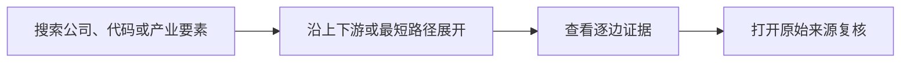
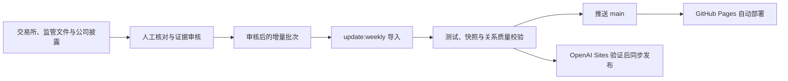
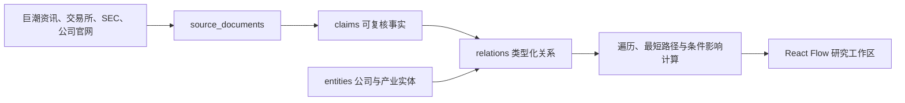

<div align="center">

# AI-ChainGraph

**把 AI 产业链、上市公司和原始证据放进同一张可交互关系图**

从材料、芯片与算力基础设施出发，沿有方向的产业关系追踪到模型、终端和行业应用。<br>
既能从产业寻找公司，也能从公司反查产业位置，并回到每条关系背后的公开来源。

[GitHub Pages 在线体验](https://judefluen-coder.github.io/ai-chaingraph/) · [OpenAI Sites 备用入口](https://ai-chaingraph.judefluen.chatgpt.site/) · [English](README.en.md)

[](public/snapshots/update-status.json)
[](https://github.com/judefluen-coder/ai-chaingraph/actions/workflows/ci.yml)
[](https://github.com/judefluen-coder/ai-chaingraph/actions/workflows/weekly-data-quality.yml)
[](LICENSE)
[](DATA_LICENSE.md)

</div>

[](https://judefluen-coder.github.io/ai-chaingraph/)

> AI-ChainGraph 不是“AI 概念股名单”，也不回答“应该买什么”。它回答的是：**一家公司在 AI 产业链中具体做什么、处在哪一环、上下游如何连接，以及这个判断来自哪里。**

## 当前快照

| 上市发行人 | 产业链 / 环节 | 公司产业映射 | 具体动作关系 | 公开证据来源 |
| ---: | ---: | ---: | ---: | ---: |
| **4,548** | **12 / 111** | **6,621** | **5,996（93.3% 公司）** | **4,636** |

- 数据版本：**v1.2.0**
- 关系层最近变化：**2026-09-08**
- 已收录来源截止：**2026-09-04**
- A 股新增上市核对截止：**2026-09-08**
- 覆盖市场：A 股与美股

公司可能出现在多个产业环节，因此各产业链的公司数不能直接相加为唯一公司数。检查时间、数据变化时间和上市核对截止日会分别记录，详见 [`update-status.json`](public/snapshots/update-status.json)。

## 30 秒看懂它能做什么

| 研究任务 | AI-ChainGraph 提供的能力 |
| --- | --- |
| 从产业寻找公司 | 从 12 条产业链进入 111 个细分环节，查看相关 A 股和美股上市公司 |
| 从公司反查产业位置 | 按公司名称或股票代码搜索，查看产品、部件、材料、设备、服务与应用映射 |
| 追踪上下游传导 | 对任意节点进行上游、下游或双向 1 / 3 / 5 跳展开 |
| 比较两个对象的连接 | 设置路径起点，寻找公司与产业要素之间的最短路径 |
| 核验一条关系 | 查看动作类型、证据等级、事实摘录、发布日期和原始公开文件 |
| 保存研究现场 | 将筛选、节点、路径和条件推演写入 URL；观察列表与备注仅保存在本地 |

典型使用路径：



## 直接探索真实数据

GitHub Pages 是默认公开入口；若所在网络可以正常访问 ChatGPT Sites，也可以使用同一项目的 Sites 版本。

| 示例 | GitHub Pages | OpenAI Sites |
| --- | --- | --- |
| AI 产业传导全景 | [打开](https://judefluen-coder.github.io/ai-chaingraph/) | [备用入口](https://ai-chaingraph.judefluen.chatgpt.site/) |
| AI 芯片与 IP | [打开](https://judefluen-coder.github.io/ai-chaingraph/?chain=chain%3Aai_chips_ip) | [备用入口](https://ai-chaingraph.judefluen.chatgpt.site/?chain=chain%3Aai_chips_ip) |
| 宇树科技（688836） | [打开](https://judefluen-coder.github.io/ai-chaingraph/?entity=issuer%3Acn-sh-688836) | [备用入口](https://ai-chaingraph.judefluen.chatgpt.site/?entity=issuer%3Acn-sh-688836) |
| 长鑫科技（688825） | [打开](https://judefluen-coder.github.io/ai-chaingraph/?entity=issuer%3Acn-sh-688825) | [备用入口](https://ai-chaingraph.judefluen.chatgpt.site/?entity=issuer%3Acn-sh-688825) |

## 核心体验

### 从产业链看公司

图谱把 EDA、处理器 IP、模拟芯片、GPU、ASIC、边缘芯片等要素放进同一张有方向的关系图。每个节点都能继续展开上下游，并查看对应公司覆盖。


### 从公司回到产业位置和证据

搜索公司名称或股票代码，即可查看它跨越的产业链、产品和应用位置。选择任意一条关系，可以检查关系类型、证据等级、事实摘要、发布日期和原始文件。


## 证据与数据边界

覆盖广度只有在关系足够具体、来源可以复核时才有意义。v1.2 将具备具体动作关系的公司从 **1,149 家（25.3%）**提升到 **4,244 家（93.3%）**；证据不足的 304 家公司仍保留为宽口径映射，不使用推断强行补齐。

| 数据语义 | 含义 |
| --- | --- |
| **L1 官方披露** | 公司公告、监管文件或公司正式资料直接支持该关系 |
| **L2 行业资料** | 可归因的公开行业资料支持产业要素之间的结构性关系 |
| **具体关系** | 证据可以说明公司在生产、开发、运营、集成、提供或分销什么 |
| **宽口径映射** | 来源只能支持公司参与较宽范围，不能继续推断到具体产品 |
| **条件传导** | 研究假设叠加层，与已核验的事实关系分开展示 |

当前已知边界：

- 304 家公司仍只有宽口径映射，等待更具体的可验证披露。
- 111 个环节的公司映射中位数为 22；HBM、PCB 基础覆铜板等 7 个环节不足 5 条。
- A 股新增上市名单已有逐项核对清单；美股上市范围仍需要独立的 SEC 与交易所来源核对。
- 当前产品使用版本化静态快照，不是实时行情、实时公告或交易系统。

覆盖不等于判断，映射不等于推荐。使用任何公司关系前，请检查证据等级、事实摘要和原始来源。

## 直接使用图谱数据

公开站点读取 [`public/snapshots/transmission-v1.1.json`](public/snapshots/transmission-v1.1.json)。文件名中的 `v1.1` 是稳定数据契约版本，快照内容版本由 `meta.data_version` 独立演进，目前为 `v1.2.0`。

```bash
# 查看版本、更新时间和核心数量
jq '.meta | {contract_version, data_version, updated_at, counts}' \
  public/snapshots/transmission-v1.1.json

# 查看当前数据质量和低覆盖环节
jq '.meta.quality | {specific_issuer_rate, sparse_segments}' \
  public/snapshots/transmission-v1.1.json
```

核心数据契约：

```text
entities          公司、证券、产业链、产品、部件、材料、设备、服务与应用
relations         产业依赖、公司产业位置、证券发行关系，以及关联的 claim_ids
claims            可复核事实摘录及其来源文档 ID
source_documents  来源标题、发布日期、公开 URL、语言和关联公司
```

## 更新机制

当前机制是**人工审核数据，脚本导入快照，GitHub Actions 自动守门**，不会把搜索结果或爬虫输出直接写入正式图谱。



- [`data/listing-reconciliations/`](data/listing-reconciliations/README.md) 记录 A 股新增上市公司的 `included` / `excluded` 结论与理由。
- [`data/weekly-candidates/`](data/weekly-candidates/README.md) 保存通过审核的增量证据批次。
- `npm run update:weekly` 导入批准批次，并生成更新状态与质量统计。
- 每周一的 GitHub Action 检查快照时效、上市核对日期、具体关系比例、测试和生产构建；它目前不自动采集或提交新证据。
- 推送到 `main` 后 GitHub Pages 自动发布；OpenAI Sites 在同一快照验证通过后单独同步。
- 没有新证据时只更新检查时间，不伪造来源截止日或数据变化日期。

完整证据政策和发布流程见 [`docs/WEEKLY_UPDATES.md`](docs/WEEKLY_UPDATES.md)。

## 技术架构



- React 18、Vite、React Flow、Dagre
- 上游 / 下游多跳遍历、最短路径与条件影响计算
- 一份规范化快照生成中英文界面与搜索索引
- 静态部署，无需注册、后端服务或付费 API
- 可恢复的 URL 研究状态、本地观察列表和研究备注

## 本地运行

需要 Node.js `22.13+`。

```bash
git clone https://github.com/judefluen-coder/ai-chaingraph.git
cd ai-chaingraph
npm ci
npm run validate:snapshot
npm run dev
```

完整校验：

```bash
npm test
npm run validate:snapshot
npm run audit:relationships
npm run build
```

## 参与贡献

欢迎补充产业本体、实体归一化、关系证据、双语内容、图布局和数据质量规则。提交前请运行上面的完整校验。

数据贡献不得包含付费数据库导出、受限原文、个人账户数据、凭证或未经许可的长篇内容。贡献格式和审查要求见 [CONTRIBUTING.md](CONTRIBUTING.md)。

## License

- 软件代码：MIT，见 [LICENSE](LICENSE)。
- 项目原创图谱结构与公开数据：CC BY 4.0，见 [DATA_LICENSE.md](DATA_LICENSE.md)。
- 外部来源文件仍受其原权利人的许可条款约束。

## 免责声明

AI-ChainGraph 是公开信息组织与产业研究辅助工具，不是投资决策工具。图谱中出现某家公司，只表示当前公开证据将它连接到某个产业要素，不代表对公司价值、经营质量、股价走势或未来收益的判断。请始终回到原始来源独立核验。
