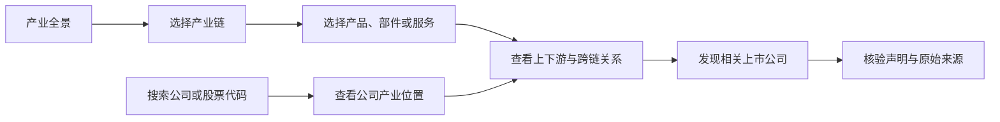
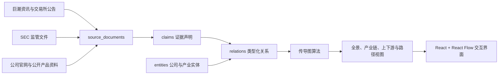

# AI-ChainGraph

> 把“产业链 -> 产业要素 -> 上市公司 -> 原始证据”连成一张可以向上追溯、向下展开的 AI 产业传导知识图谱。

[](https://ai-chaingraph.judefluen.chatgpt.site/)
[](https://github.com/judefluen-coder/ai-chaingraph)
[](https://github.com/judefluen-coder/ai-chaingraph/actions/workflows/ci.yml)
[](LICENSE)
[](DATA_LICENSE.md)

[在线体验](https://ai-chaingraph.judefluen.chatgpt.site/) · [GitHub Pages](https://judefluen-coder.github.io/ai-chaingraph/) · [English](README.en.md) · 简体中文

AI-ChainGraph 不是一张“AI 概念股名单”。它从产业依赖关系出发，把材料、芯片、算力基础设施、模型软件、终端和行业应用连接起来，再把 A 股与美股公司放回它们实际参与的产业位置，并保留每条公司关系背后的公开来源。

> 本项目用于公开信息组织与产业研究，不提供投资建议、买卖信号、目标价、收益预测或交易策略。


## 它能解决什么问题

研究 AI 产业时，信息通常散落在年报、公告、产品文档和行业资料中。股票软件能告诉你“有哪些概念股”，但很难回答：

- 一家公司究竟位于哪条 AI 产业链、哪个具体环节？
- 一个产业要素的上游输入、下游去向和跨链依赖是什么？
- 从 GPU、服务器到数据中心、模型和应用，影响是如何传导的？
- 某条公司映射来自官方披露，还是仅仅属于宽口径关联？
- 结论对应哪份公告或监管文件，能否回到原文复核？

AI-ChainGraph 把这些问题放在同一张可交互图谱里回答。

## 你可以用它做什么

| 研究任务 | AI-ChainGraph 提供的能力 |
| --- | --- |
| 从产业寻找公司 | 从 6 个能力域、12 条产业链和 111 个产业环节逐层进入，查看对应 A 股与美股公司 |
| 从公司反查产业位置 | 搜索公司或股票代码，查看公司横跨的产业链、产品、部件、服务和应用位置 |
| 追踪上下游传导 | 从任意节点向上游、下游或双向展开 1、3、5 跳事实关系 |
| 比较产业路径 | 把任意实体设为路径起点，寻找它与另一个产业要素或公司之间的最短路径 |
| 核验公司关系 | 区分 L1 官方披露、L2 行业资料和宽口径映射，并打开对应原始来源 |
| 做条件推演 | 在事实图谱之上叠加需求、供给、价格、产能、政策或技术变化，观察可能的传导方向 |
| 建立研究清单 | 将公司加入本地观察列表，记录优先级、标签、复核日期和研究假设，并导出 CSV |
| 分享研究上下文 | 把公司、关系、产业链、方向和展开深度写入 URL，复制链接即可恢复同一视图 |
| 跨市场与双语研究 | 支持全部市场、A 股、美股筛选，以及中英文界面与搜索 |

## 两条典型研究路径



## 真实界面

### 产业链拆解

以“AI 芯片与 IP”为例，图谱将 EDA、处理器 IP、模拟芯片、GPU、ASIC、边缘芯片等要素放入同一条有方向的事实关系图，并显示每个要素对应的公司覆盖。


### 公司位置与逐边证据

进入公司后，可以看到它参与的多个产业位置；选择其中一条关系，可以查看关系类型、证据等级、事实摘要、发布日期以及原始文件链接。


## v1.1 数据规模

当前公开快照更新时间为 **2026-07-18**，覆盖 A 股与美股上市公司。

| 数据对象 | 数量 | 说明 |
| --- | ---: | --- |
| 能力域 | 6 | 芯片、材料、算力、云、软件、终端与应用等上层分组 |
| 产业链 | 12 | 从半导体制造到 AI 行业应用 |
| 产业环节 | 111 | 每条产业链中的细分 segment |
| 上市公司 / 证券 | 4,537 | 已标准化的发行人与证券实体 |
| 公司产业映射 | 6,603 | 公司到产品、部件、服务、设备、材料等具体要素的关系 |
| 产业依赖关系 | 173 | `input_to`、`component_of`、`enables`、`used_in` 等有方向关系 |
| 证据声明 | 6,621 | 从公开文件中提取并关联到图谱关系的事实声明 |
| 公开来源 | 4,616 | 巨潮资讯、SEC、交易所、公司官网及公开产品资料 |

公司可能同时出现在多条产业链和多个产业要素中，因此各链显示的公司数不能直接相加为唯一公司数。

## 项目结构



核心数据契约由四部分组成：

- `entities`：能力域、产业链、产业环节、产品、部件、材料、设备、服务、公司和证券。
- `relations`：产业依赖、公司产业位置、证券发行关系，以及关系对应的 `claim_ids`。
- `claims`：可核验的事实摘录及其来源文档 ID。
- `source_documents`：来源标题、发布日期、URL、语言和关联公司。

公开站点直接读取 [`public/snapshots/transmission-v1.1.json`](public/snapshots/transmission-v1.1.json)，不依赖付费 API 或登录账户。

## 技术实现

- **React 18 + Vite**：单页应用与静态部署。
- **React Flow**：可缩放、可交互的关系图。
- **Dagre**：产业全景、链路和路径的自动布局。
- **图遍历与最短路径**：支持上游、下游、多跳展开和任意两点路径查询。
- **双语视图模型**：同一份图谱数据生成中英文界面。
- **研究工作区**：左侧产业导航、右侧范围检查器，以及浏览器本地观察列表与研究备注。
- **可恢复 URL 状态**：保存当前实体、关系、产业链、查询方向、深度、路径和条件推演。
- **静态公开快照**：GitHub Pages 与 OpenAI Sites 使用同一份 v1.1 数据。

主要目录：

```text
src/main.jsx                         应用状态、搜索、路径与条件传导入口
src/lib/transmissionGraph.js         图遍历、最短路径和条件影响计算
src/lib/transmissionViewModel.js     数据索引、筛选、布局与界面视图模型
src/lib/workspaceState.js            可复制、可恢复的研究视图 URL 状态
src/lib/watchlist.js                 本地观察列表、研究备注与 CSV 导出
src/components/                      导航、图谱画布和证据详情面板
public/snapshots/transmission-v1.1.json 公开 v1.1 图谱快照
scripts/validate-public-snapshot.mjs 发布快照完整性与引用校验
scripts/build-sites.mjs              OpenAI Sites 静态部署打包
docs/assets/                         README 项目截图
```

## 本地运行

需要 Node.js `22.13+`。

```bash
git clone https://github.com/judefluen-coder/ai-chaingraph.git
cd ai-chaingraph
npm ci
npm run validate:snapshot
npm run dev
```

生产构建：

```bash
npm run build
```

Vite 默认会在 `http://127.0.0.1:5173/` 启动开发服务器。推送到 `main` 后，GitHub Actions 会校验完整快照并自动更新 GitHub Pages。

## 数据应该怎样理解

- **L1 官方披露**：公司公告、监管文件或公司正式资料直接支持这条关系。
- **L2 行业资料**：公开行业资料支持产业要素之间的结构性关系。
- **具体要素**：证据能够定位到产品、部件、材料、设备或服务层级。
- **宽口径映射**：来源支持公司与较宽产业范围相关，但不足以得出更具体的产品结论。
- **条件传导**：仅用于研究假设，不会与已经核验的事实关系混在一起。

覆盖广度不等于结论强度。使用任何公司映射前，都应查看证据等级、摘要和原始来源。

## 贡献

欢迎改进产业本体、实体归一化、关系证据、双语体验、图布局与数据质量校验。提交前请运行：

```bash
npm run validate:snapshot
npm run build
```

数据贡献不得包含付费数据库导出、受限原文、个人账户数据、凭证或未经许可的长篇内容。详细规则见 [CONTRIBUTING.md](CONTRIBUTING.md)。

## License

- 软件代码：MIT，见 [LICENSE](LICENSE)。
- 项目原创图谱结构与公开数据：CC BY 4.0，见 [DATA_LICENSE.md](DATA_LICENSE.md)。
- 外部来源文件仍受其原权利人的许可条款约束。

## 免责声明

AI-ChainGraph 是信息组织与产业研究辅助工具，不是投资决策工具。图谱中出现某家公司，只表示当前公开数据将它连接到某个产业要素，不代表对公司价值、经营质量、股价走势或未来收益的判断。请始终回到原始来源独立核验。
